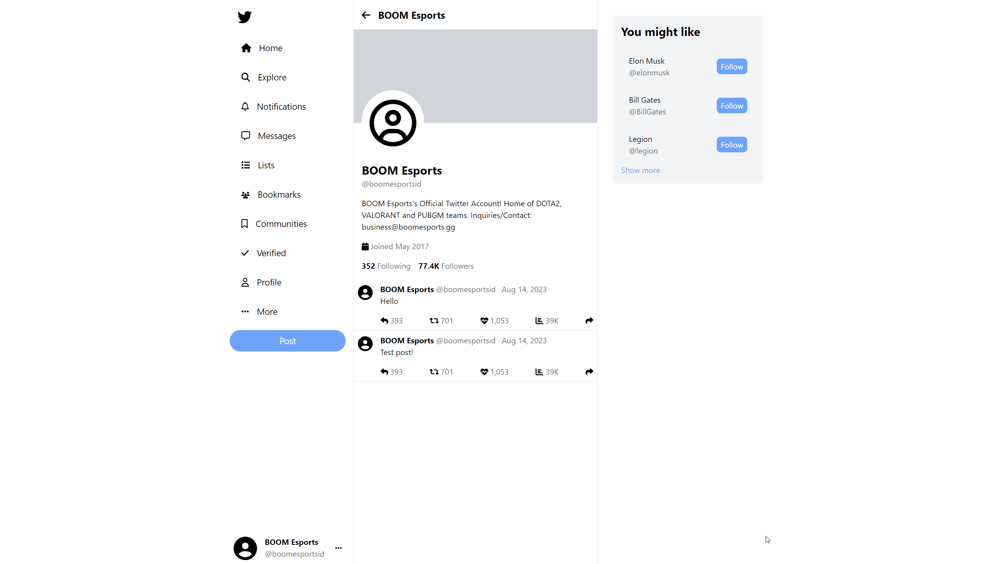

# Twitter-Clone by Muhammad Naufal

Check it live [here](https://64d9dd52d2d5de14d9d9801b--radiant-kangaroo-820164.netlify.app).\
Backend [here](https://twitter-clone-api-75lp.onrender.com).

## Setup

Open two tabs for client and server.

### Client

```
cd client
yarn install
yarn start
```

### Server

```
cd server
yarn install
yarn start
```

## Screenshot

### Profile


